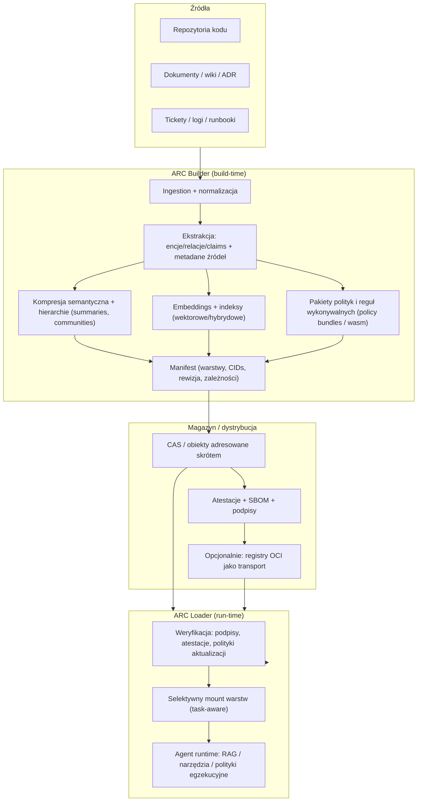

# Agent Archive (.arc) jako przenośne, semantyczne, weryfikowalne i przyrostowe opakowanie kontekstu agentów

## Podsumowanie wykonawcze

„Agent archive” (.arc) ma sens jako **artefakt infrastrukturalny**: przenośny pakiet, który agent ładuje *przed pracą*, aby mieć stabilny dostęp do **zweryfikowanej wiedzy, decyzji, polityk, narzędzi i indeksów semantycznych** – bez przepalania kosztów na ciągłe ponowne składanie kontekstu w locie. Najbliższe pokrewne rozwiązania (pamięć agentów, checkpointy, RAG na repozytoriach) rozwiązują fragmenty problemu, ale zwykle nie dostarczają **jednego przenośnego i kryptograficznie weryfikowalnego artefaktu** „kontekstowego”, który da się dystrybuować i aktualizować przyrostowo. citeturn17view0turn17view1turn18view0turn10view0

Rekomendowany wzorzec architektury dla .arc to **hybryda**:  
(1) **manifest** + **treść adresowana skrótem (CAS / Merkle DAG)** dla przyrostowości i odporności na manipulacje, (2) **warstwa semantyczna** (fakty/roszczenia/relacje/uzasadnienia) oraz (3) **warstwa wykonawcza i egzekucyjna** (polityki + sandboxowane „reguły/narzędzia”), wszystko spięte (4) **proweniencją i atestacjami** oraz (5) **podpisami**. Koncepcyjnie warto kopiować to, co zadziałało w ekosystemie artefaktów: content addressing i niezmienność w Merkle DAG citeturn19view0, dystrybucję artefaktów przez rejestry OCI (w tym podpisy/SBOM/polityki) citeturn13view0turn13view1turn13view2 oraz supply-chain’owe mechanizmy zaufania (podpisy + transparency log, atestacje, ochrona aktualizacji). citeturn11view1turn11view2turn20view0turn20view1

W praktyce .arc powinien działać w trzech trybach:
- **build**: z surowych źródeł (repo/dokumenty/tickety/logi) tworzy struktury semantyczne i indeksy, zapisuje jako warstwy adresowane skrótem oraz generuje manifest; citeturn16view0turn19view0  
- **load**: agent przed zadaniem weryfikuje podpisy/atestacje, montuje tylko potrzebne warstwy (hierarchicznie i „progressive disclosure”); citeturn10view0turn17view0  
- **update**: nowe wersje powstają jako różnice/warstwy, z formalną kontrolą spójności i mechanizmami „rollback protection”. citeturn20view1turn10view0

Największe ryzyka są bezpieczeństwa i jakości: (a) prompt injection i pośrednie wstrzyknięcia przez zewnętrzne źródła, (b) „poisoning” wiedzy/indeksów, (c) przestarzałe archiwa (stale context) oraz (d) zbyt agresywna kompresja semantyczna psująca wierność. Te ryzyka są dobrze opisane w standardowych taksonomiach zagrożeń dla aplikacji LLM. citeturn14view0turn14view1

## Definicja, zakres i wymagania

**Definicja robocza**: Agent archive (.arc) to **przenośny artefakt** zawierający *uporządkowaną i weryfikowalną reprezentację kontekstu*, który agent (lub runtime agentów) może załadować przed pracą, z gwarancjami: (1) pochodzenia, (2) integralności, (3) przyrostowej aktualizacji oraz (4) możliwości selektywnego montowania tylko potrzebnych fragmentów.

Zakres warto rozdzielić na dwa poziomy:
- **„Kontekst wiedzy i zasad”** (długowieczny): fakty, decyzje, polityki, procedury, narzędzia, artefakty organizacyjne. To ma być wersjonowane i dystrybuowalne. citeturn10view0turn17view0  
- **„Stan pracy”** (krótkowieczny): checkpointy/stan grafu/agent loop, które są świetne do wznawiania i debugowania, ale nie muszą być częścią .arc jako standardu dystrybucyjnego. Tu inspiracją są systemy checkpointowania stanu, które zapisują migawki wykonania (threads, checkpoints). citeturn17view1

Minimalny, sensowny zakres .arc (co powinien umieć przenieść między środowiskami i modelami) obejmuje:
- **Fakty i twierdzenia**: atomowe „claims” z odnośnikami do źródeł i pewnością (confidence), plus relacje między nimi (graf wiedzy). Podejścia w stylu GraphRAG pokazują, że ekstrakcja encji/relacji/kluczowych twierdzeń i budowanie hierarchii wspólnot (communities) ma znaczenie dla skalowania rozumienia korpusu. citeturn16view0  
- **Decyzje**: zapis „dlaczego tak” (kontekst → opcje → decyzja → konsekwencje), bo to jest informacja o wysokiej wartości dla agentów (redukuje ryzyko „powrotu do dyskusji od zera”).  
- **Polityki i reguły egzekucyjne**: np. reguły dostępu/bezpieczeństwa/zgodności, najlepiej w formie, którą można uruchomić deterministycznie (polityki jako bundle, możliwość podpisu, rewizje, a nawet wariant WASM). citeturn11view3  
- **Narzędzia i ich kontrakty**: specyfikacje narzędzi (opis, wejścia/wyjścia, limity, uprawnienia), plus ewentualnie kod pomocniczy/plug-iny uruchamiane w sandboxie. Model sandboxu modułów jest naturalny w ekosystemie WebAssembly. citeturn12view0turn11view3  
- **Embeddings i indeksy**: wektory + metadane (model embeddingów, wersja, wymiar, normalizacja, przestrzenie/namespaces), potencjalnie hybrydowo (wektory + BM25), bo to praktycznie zwiększa odporność na przypadki brzegowe. citeturn3search5turn3search2  
- **Proweniencję i łańcuch zaufania**: kto i jak zbudował archiwum (builder, źródła, parametry), najlepiej w formie atestacji kompatybilnej z istniejącymi frameworkami supply-chain. citeturn11view2turn20view0

Kluczowe wymagania niefunkcjonalne:
- **Przenośność**: bez zależności od jednego dostawcy runtime; dystrybucja jako plik lub przez standardową infrastrukturę artefaktów (np. rejestry OCI). citeturn13view0turn13view2  
- **Semantyczność**: nie tylko „zipped text”, ale struktury umożliwiające nawigację, selekcję i weryfikację „co jest ważne”. citeturn16view0turn17view0  
- **Weryfikowalność**: integralność, podpisy, atestacje, odporność na manipulacje i rollback. citeturn11view1turn20view1turn19view0  
- **Przyrostowość**: szybkie aktualizacje (diff/patch), bez przebudowy całego archiwum. Mechanizmy w stylu Merkle DAG oraz wersjonowanie pamięci jako repozytorium są tu bardzo trafną inspiracją. citeturn19view0turn10view0  

## Architektura i podejścia projektowe

Najbardziej praktyczny model .arc to „**warstwowy artefakt kontekstu**” zbudowany z małych, niezmiennych bloków (adresowanych skrótem), z manifestem opisującym: warstwy, zależności, rewizję oraz politykę ładowania (policy prioritization, progressive disclosure). Wzorzec „progressive disclosure” i hierarchicznego drzewa plików jako sygnału nawigacyjnego dobrze sprawdza się w kontekście pamięci agentów i jest zgodny z intuicją: agent nie powinien ładować wszystkiego zawsze, tylko mieć mechanizm „pinned core + reszta na żądanie”. citeturn10view0turn17view0

Poniżej zwięzły, rekomendowany przepływ:



**Podejście: kompresja semantyczna**  
Najbardziej obiecujące jest podejście wieloetapowe: najpierw ekstrakcja i strukturyzacja, potem kompresja pod budżet tokenów/rozmiar. W literaturze prompt compression (np. LLMLingua/LongLLMLingua) widać, że da się agresywnie redukować długość przy kontrolowaniu utraty informacji, używając podejść coarse-to-fine i selekcji istotnych fragmentów. citeturn1search0turn1search1

**Podejście: hierarchiczny kontekst**  
GraphRAG to ważny punkt odniesienia: proces obejmuje dzielenie korpusu na jednostki tekstowe, ekstrakcję encji/relacji/claims, klastrowanie hierarchiczne grafu i generowanie streszczeń „od dołu”, a potem tryby zapytań (global/local) korzystające z tej hierarchii. To jest bardzo zbieżne z ideą .arc jako „hierarchicznego magazynu wiedzy”, który da się montować zależnie od zadania. citeturn16view0turn7search0

**Podejście: przyrostowe różnice**  
Dwa komplementarne wzorce:
- *Bloki niezmienne + nowy root manifest* (Merkle/CAS): różnica = tylko nowe bloki i nowy manifest. W Merkle DAG zmiana w węźle zmienia jego identyfikator i propaguje się do przodków, co daje naturalną „samoweryfikację” struktury i efektywne synchronizacje. citeturn19view0  
- *Repozytorium pamięci (git-backed)*: każda zmiana ma commit, jest widoczna, możliwe są równoległe worktree i rozwiązywanie konfliktów standardowymi operacjami. To podejście pojawia się w praktycznych systemach pamięci dla agentów kodujących. citeturn10view0

**Podejście: „wykonywalne archiwa”**  
Wykonywalność ma sens wyłącznie tam, gdzie **redukuje ryzyko** lub **zwiększa deterministyczność**, np.:
- polityki jako bundle z rewizją, opcjonalnym podpisem, wsparciem „delta bundles” i możliwością wariantu WASM; citeturn11view3  
- sandboxowane moduły narzędzi/reguł (np. WebAssembly), bo model bezpieczeństwa zakłada wykonywanie w izolacji i brak „ucieczki z sandboxa” bez jawnych API. citeturn12view0  

**Proponowane komendy CLI/SDK** (propozycja kontraktu ergonomicznego, niezależna od technologii implementacji):

```bash
# inicjalizacja projektu archiwum
arc init --name my-project --out my-project.arc

# budowa archiwum z repo + dokumentów
arc build --sources repo://. docs://./docs tickets://jira --profile standard

# inspekcja: warstwy, rewizje, rozmiary, metadane embeddingów
arc inspect my-project.arc

# selektywna ekstrakcja: polityki, decyzje, graf wiedzy
arc extract my-project.arc --what policies --out ./policies/
arc extract my-project.arc --what decisions --out ./adr/

# weryfikacja integralności + podpisów + atestacji
arc verify my-project.arc --policy tuf --attest slsa --sigstore

# różnica i merge
arc diff my-project@v1 my-project@v2 --out changeset.arc
arc merge base.arc theirs.arc ours.arc --strategy semantic-3way --out merged.arc

# publikacja i pobranie (np. rejestr OCI)
arc push my-project.arc oci://registry.example.com/arc/my-project:1.2.3
arc pull oci://registry.example.com/arc/my-project:1.2.3 --out my-project.arc
```

## Modele danych i formaty

Projekt .arc powinien rozdzielać **model danych** (co opisujemy) od **formatu serializacji** (jak zapisujemy). Dzięki temu .arc nie blokuje się na jednej technologii (ważne przy otwartych założeniach dot. skali/latencji/modeli).

### Minimalny model danych

Rdzeń można opisać jako zestaw typów:
- **Resource**: dowolny obiekt źródłowy (plik, dokument, ticket), z identyfikatorem, skrótem, licencją i metadanymi.  
- **TextUnit/Chunk**: jednostka przetwarzania (fragment), z odnośnikiem do Resource oraz zakresem.  
- **Claim**: twierdzenie/fakt (z dowodem: pointery do TextUnit), opcjonalnie z relacjami i confidence.  
- **Decision**: struktura decyzji (kontekst, opcje, decyzja, konsekwencje), z odnośnikami do źródeł.  
- **Policy**: reguły + data, najlepiej możliwe do uruchomienia/zweryfikowania (bundle). citeturn11view3  
- **EmbeddingIndex**: opis indeksów (model, wymiary, wersja, przestrzeń, filtry), plus pointer do shardów. citeturn3search2turn3search5  
- **Provenance/Attestation**: kto zbudował, z czego i jak, w formie możliwej do weryfikacji. citeturn11view2turn20view0  
- **Manifest**: root opisujący skład, warstwy, CIDs/digests, rewizję, zależności i politykę mountowania.

### Standardy semantyki i proweniencji

Dla warstwy grafowej warto wykorzystywać istniejące standardy Linked Data: JSON-LD jako zgodny z JSON sposób serializacji danych powiązanych oraz RDF jako model grafów oparty o trójki (subject-predicate-object). citeturn2search1turn2search2  
Proweniencję sensownie mapować do PROV-O, bo dostarcza zestaw klas i relacji do wymiany informacji o pochodzeniu danych. citeturn2search0

### Dystrybucja i opakowanie warstw

Dwa pragmatyczne warianty transportu:
- **Plik lokalny** (np. tar/zip): prosty offline, ale gorzej z deduplikacją i przyrostowością na poziomie bloków.  
- **Artefakt w rejestrze OCI**: re-use infrastruktury rejestrów, gdzie manifest wskazuje warstwy, artefakt może być adresowany tagiem lub digestem, a w świecie OCI praktycznie występują już podpisy, SBOM i bundle polityk. citeturn13view0turn13view1  

W praktyce to wspiera wzorzec: **.arc jako „OCI artifact / index + layers”** (albo równoważny layout na dysku). ORAS wprost opisuje, że OCI artifacts obejmują różne typy treści (w tym podpisy, SBOM i bundle polityk), oraz że mogą być przechowywane w registry (CAS) lub jako layout na dysku. citeturn13view0

SBOM w .arc ma sens, jeśli archiwum zawiera wykonywalne elementy (polityki/narzędzia) lub ma być konsumowane w środowisku o wymaganiach compliance: tu typowe są SPDX i CycloneDX. citeturn6search0turn6search21turn6search1

### Porównawcza tabela kandydatów projektowych

| Kandydat formatu/układu | Główna idea | Plusy | Minusy | Najlepsze dopasowanie |
|---|---|---|---|---|
| „Manifest + blobs” (JSON/CBOR) + CAS | Root manifest wskazuje na bloki treści; bloki są niezmienne i adresowane skrótem | Najprostsze do wdrożenia; świetne diffs; łatwa deduplikacja | Brak ustandaryzowanej semantyki (trzeba schematów); trzeba zaprojektować query layer | MVP, szybkie prototypy, archiwa repozytoriów i dokumentów |
| Graf wiedzy (JSON-LD/RDF) + osobne warstwy dowodów | Claims i relacje jako graf; dowody jako pointery do chunków | Lepsza nawigacja semantyczna; łatwiej weryfikować i łączyć wiedzę | Wyższy koszt budowy; potrzebne dobre ekstraktory; ryzyko „noisy graph” | Firmy/produkty, compliance, „dlaczego” (decyzje) |
| „Vector shards jako first-class” + metadane | Shardy embeddingów i indeksy w archiwum lub referencje do vector DB | Szybkie RAG; łatwa integracja z narzędziami | Silna zależność od embeddera i parametrów; migracje indeksów bywają kosztowne | Copilot-y, asystenci kodu/dokumentów, duże korpusy |
| „Executable archive” (policy bundles + wasm tools) | Archiwum przenosi reguły i narzędzia, uruchamiane deterministycznie w sandboxie | Egzekucja polityk; mniejsze ryzyko halucynacji w regułach; automatyczna walidacja | Wysoki próg bezpieczeństwa; potrzeba sandboxu i modelu uprawnień | Archiwa bezpieczeństwa, governance, agent tooling w enterprise |
| OCI artifact jako wspólny nośnik (.arc jako artefakt) | Dystrybucja przez registry, „layers/manifest/referrers” | Gotowa infrastruktura dystrybucji i deduplikacji; łatwe „attached artifacts” (podpisy/atestacje) | Portability zależy od wsparcia registry i konwencji mediaType | Dystrybucja w organizacji, CI/CD, supply-chain traceability |

Uzasadnienie technologiczne tabeli (CAS/Merkle, OCI, polityki jako bundle, hybrydowy i wektorowy retrieval) jest dobrze wspierane przez opisy Merkle DAG i content addressing citeturn19view0, przez przewodniki OCI artifacts i zmiany w specyfikacjach (subject/artifactType/referrers) citeturn13view0turn13view1 oraz przez praktykę policy bundli i hybrydowych wyszukiwań wektorowo-leksykalnych. citeturn11view3turn3search5

## Algorytmy i metody ML

Najtrudniejszy element .arc to nie „opakowanie plików”, tylko **redukcja i uporządkowanie znaczenia** bez utraty krytycznych informacji.

### Ekstrakcyjne vs abstrakcyjne ścieżki kompresji

W kontekście agentów, gdzie liczy się wierność (fidelity), praktyczny jest układ „extract first, then abstract”:
- **Ekstrakcja**: wybór fragmentów źródłowych (extractive) jako „dowody” i minimalne fakty/roszczenia;  
- **Abstrakcja**: streszczenia, ale zawsze z krawędziami do dowodów i z automatycznymi testami spójności (patrz metryki w sekcji o ewaluacji).  

Rozwiązania prompt compression (LLMLingua) pokazują, że da się kontrolować budżet i zachowywać semantykę przy wysokich stopniach kompresji, stosując selekcję wieloetapową i iteracyjne przycinanie pod tokeny. citeturn1search0turn1search1

### Chunking i „TextUnits”

Chunking powinien wynikać z natury domeny:
- dla kodu: granice plików, modułów, symboli;  
- dla dokumentacji: sekcje i nagłówki (plus „frontmatter” jako metadane);  
- dla ticketów/logów: jednostki zdarzeń i wątki.  

Wzorzec GraphRAG explicite zakłada pocięcie korpusu na TextUnits jako podstawę do ekstrakcji i późniejszego łączenia wyników (dowody i referencje), co jest spójne z wymaganiem „provenance-by-default”. citeturn16view0

### Embeddings, wyszukiwanie hybrydowe i „retrieval-augmented compression”

Dla agent archive ważne są dwa tryby:
- **build-time retrieval**: podczas budowy archiwum builder używa embeddings/hybrid search, aby łączyć odległe wątki i wykrywać duplikaty;  
- **run-time retrieval**: agent montuje warstwę wektorową, by dobierać kontekst do zadania.

W praktyce hybrydowe wyszukiwanie (wektor + BM25) jest opisywane jako łączenie mocnych stron semantyki i dopasowania słów kluczowych. citeturn3search5turn3search1  
Z punktu widzenia archiwum, oznacza to, że **„vector shards” powinny być wersjonowane razem z resztą kontekstu**, bo „świeżość indeksu” i zgodność parametrów wpływa na jakość. Systemy kontekstowe w obszarze kodu podkreślają, że świeżość indeksów jest krytyczna, by uniknąć użycia przestarzałego kontekstu. citeturn18view1turn3search6

### Hierarchizacja wiedzy (GraphRAG jako wzorzec)

GraphRAG dostarcza gotowy schemat: ekstrakcja encji/relacji/claims → klastrowanie hierarchiczne grafu → streszczenia wspólnot → wyszukiwanie globalne/lokalne. Dla .arc jest to szczególnie atrakcyjne, bo naturalnie tworzy „warstwy” (np. stresszczenia poziomu L0/L1/L2) i daje kontrolę nad montowaniem kontekstu. citeturn16view0turn7search0

### Continual learning i „ciągłe uczenie” w kontekście .arc

Warto rozdzielić:
- **continual learning modelu** (fine-tuning / aktualizacja wag) – zwykle zbyt kosztowne i trudne do weryfikacji w produkcji;  
- **continual learning pamięci** (aktualizacja archiwum) – celem .arc jest właśnie to.

Literatura o pamięci długoterminowej i ko-trenowanych retrieverach sugeruje, że łączenie mechanizmów pamięci i retrieval może poprawiać utrzymanie informacji w długim horyzoncie, ale .arc powinien traktować to jako *opcjonalny moduł*, a nie wymóg standardu. citeturn0search12turn0search4

## Bezpieczeństwo, zaufanie i spójność aktualizacji

### Model zagrożeń

Dla .arc model zagrożeń nie jest dodatkiem – to rdzeń specyfikacji, bo archiwum staje się „źródłem prawdy” dla agenta. Typowe klasy ryzyk dla aplikacji LLM obejmują prompt injection, poisoning, supply chain i DoS; są one wprost katalogowane w OWASP Top 10 dla aplikacji LLM. citeturn14view0turn14view1  
W kontekście .arc szczególnie groźne są:
- **Indirect prompt injection** przez treści wciągane do archiwum (np. dokumenty, strony, pliki), bo agent może potraktować fragment jako instrukcję. citeturn14view1  
- **Poisoning archiwum**: wstrzyknięcie fałszywych faktów, skażenie embeddingów lub manipulacja politykami/narzędziami. citeturn14view0  
- **Rollback/stale archive**: podmiana na starszą wersję lub użycie przestarzałego indeksu. Ochrona przed rollback jest klasycznym celem bezpiecznych systemów aktualizacji. citeturn20view1turn18view1  

### Warstwa integralności i niezmienności

Content addressing i Merkle DAG dostarczają naturalnej „tamper-evidence”: węzły są niezmienne, identyfikator wynika ze skrótu zawartości i dzieci, a struktura jest samoweryfikowalna. citeturn19view0  
W praktyce .arc powinien:
- hashować każdy blok (chunk, shard wektorów, bundle polityk, manifest),  
- budować root manifest jako „hash tree root”,  
- umożliwiać dystrybucję tylko brakujących bloków w aktualizacji.

### Podpisy i transparency log

Podpis root manifestu powinien być możliwy do weryfikacji offline. W ekosystemie podpisywania artefaktów istotny jest wzorzec: podpis + timestamp + dowód inkluzji w transparency log (np. Signed Entry Timestamp), co umożliwia dowodzenie, że podpis istniał i został zarejestrowany bez konieczności ciągłego odpytywania logu. citeturn11view1  

### Atestacje i proweniencja

Proweniencja (kto, kiedy, jak zbudował) jest kluczowa, bo pozwala konsumentowi zweryfikować, czy archiwum powstało „zgodnie z oczekiwaniami”. Specyfikacje proweniencji opisują to jako weryfikowalną informację o tym, gdzie/kiedy/jak artefakt został wytworzony i jak to sprawdzać. citeturn11view2  
Dla .arc warto przyjąć konwencję: atestacje w formacie kompatybilnym z in-toto (claims/predicates), bo to ogólny framework dla weryfikowalnych oświadczeń o supply chain. citeturn20view0turn11view2

### Bezpieczne aktualizacje i odporność na rollback

System aktualizacji .arc (szczególnie jeśli archiwa są dystrybuowane centralnie) powinien mieć ochronę przed rollback i kompromitacją kluczy, analogicznie do bezpiecznych frameworków aktualizacji. Specyfikacje bezpiecznych aktualizacji kładą nacisk na wykrywanie rollback, role/klucze progowe i minimalizację skutków kompromitacji. citeturn20view1  

### Sandboxing i egzekwowanie polityk

Jeśli .arc zawiera elementy wykonywalne (narzędzia/reguły), sandbox jest obowiązkowy. Model WebAssembly opisuje wykonywanie modułów w odizolowanym środowisku z ograniczonym wyjściem przez API oraz z właściwościami izolacji. citeturn12view0  
Polityki dobrze przenosić jako bundle (archiwum tar.gz z politykami i danymi), bo to ustandaryzowany sposób dystrybucji reguł, z rewizją i możliwością podpisu; OPA wspomina też o scenariuszach, gdzie część danych aktualizuje się częściej (delta bundles) i o opcjonalnym `policy.wasm`. citeturn11view3

### Spójność, merge i rozwiązywanie konfliktów

Przyrostowość prowadzi do konfliktów. Dwie praktyczne strategie:
- **Semantyczny 3-way merge**: merge dla warstw „facts/decisions” powinien uznawać konflikty logiczne (np. dwa sprzeczne claims), a nie tylko różnice tekstu; to wymaga walidatorów spójności w builderze.  
- **Worktree + standardowe operacje merge**: jeśli pamięć/archiwum jest utrzymywana jak repozytorium, konflikty rozwiązuje się operacyjnie (z ludzkim nadzorem lub przez agentów pomocniczych). Systemy pamięci git-backed podkreślają właśnie możliwość równoległej pracy subagentów i rozwiązywania konfliktów przez standardowe operacje. citeturn10view0  

Warto to spiąć z governance: polityki decydują, czy agent może automatycznie zmergować konflikty, czy wymaga to „human-in-the-loop”.

## Ocena, metryki i eksperymenty

Ocena .arc musi mierzyć zarówno **skuteczność kompresji**, jak i **bezpieczeństwo zaufania**. W praktyce potrzebujesz metryk na trzech warstwach: (1) retrieval i dobór kontekstu, (2) wierność i użyteczność generacji, (3) koszty/latencja.

### Metryki rekomendowane

**Retrieval / kontekst**:
- *Context Precision / Context Recall* – metryki mierzące, czy dostarczony kontekst jest użyteczny i kompletny względem odpowiedzi referencyjnej. citeturn7search3turn7search1  
- *RAG triad (context relevance / groundedness / answer relevance)* – praktyczny zestaw do wykrywania odpowiedzi nieugruntowanych w kontekście. citeturn7search15  

**Wierność i jakość streszczeń/kompresji**:
- *BERTScore* jako miara podobieństwa semantycznego do referencji; przydatne do porównywania streszczeń i wariantów kompresji. citeturn7search8  
- Metryki spójności faktów: FactCC (faktyczna zgodność streszczeń) i SummaC (benchmark spójności). citeturn8search1turn8search15turn8search17  

**Efektywność**:
- redukcja tokenów/rozmiaru („compression ratio”),  
- latencja: build-time i load-time,  
- koszt: liczba wywołań modeli, czas indeksowania, koszt przechowywania.

### Zestaw eksperymentów walidacyjnych

Poniższe eksperymenty są zaprojektowane tak, aby dało się je uruchamiać regresyjnie (CI dla archiwum) i aby oddzielić: retrieval, kompresję, oraz mechanizmy zaufania.

**Eksperymenty jakości i wierności kompresji**
- **Long-context QA przed/po kompresji**: weź zadania z benchmarków długiego kontekstu i porównaj skuteczność odpowiedzi dla (a) baseline RAG, (b) .arc z hierarchią streszczeń, (c) .arc + selektywna dekompresja (dowody). Użyj zbiorów typu LongBench (i v2, jeśli testujesz ekstremalne długości) oraz ZeroSCROLLS. Metryki: accuracy/EM/F1 (gdy dostępne), plus RAGAS context precision/recall i groundedness. citeturn9search12turn9search0turn9search1turn7search3turn7search15  
- **Multi-hop i „łączenie kropek”**: test na HotpotQA (wymaga łączenia faktów z wielu dokumentów). Porównaj: (a) czyste wektory, (b) graf claims+relacji, (c) graf + streszczenia wspólnot. To bezpośrednio mierzy wartość warstwy grafowej. citeturn9search3turn16view0  
- **Prompt compression jako etap build-time**: porównaj builder, który używa pełnych chunków, z builderem używającym metod w stylu LLMLingua/LongLLMLingua do selekcji i przycinania. Metryki: kompresja tokenów i jakość odpowiedzi (jak wyżej). citeturn1search0turn1search1  
- **Spójność streszczeń i claims**: generuj streszczenia/claims i oceniaj FactCC/SummaC względem źródeł; automatycznie flaguj regresje. citeturn8search1turn8search17  

**Eksperymenty w domenie kodu**
- **Repo-level code completion / retrieval**: użyj RepoBench i zmierz, czy .arc poprawia retrieval i completion w porównaniu do baseline (np. sam wektorowy retrieval). citeturn9search10turn9search2  
- **Real-world issue fixing**: użyj SWE-bench jako harnessu do oceny agentów w zadaniach naprawy issue. Porównaj: (a) agent bez archiwum, (b) agent z repo.arc (fakty, decyzje, indeksy), (c) agent z repo.arc + polityki i sandbox narzędzi. citeturn8search5turn8search2  

**Eksperymenty zaufania i odporności na ataki**
- **Tamper test**: podmień pojedynczy blok (np. shard embeddingów) i sprawdź, czy `arc verify` wykrywa zmianę (hash mismatch i/lub invalid signature). To sprawdza CAS i podpisy. citeturn19view0turn11view1  
- **Rollback test**: spróbuj wymusić starszą wersję archiwum jako „latest” i sprawdź, czy polityka aktualizacji blokuje rollback (na wzór frameworków aktualizacji). citeturn20view1  
- **Prompt injection przez źródła**: zasiej w dokumentach instrukcje „udające politykę” i sprawdź, czy agent/runtime potrafi je sklasyfikować jako dane, nie instrukcje; oceniaj też, czy system wykrywa nieugruntowane odpowiedzi triadą RAG. citeturn14view1turn7search15  
- **Poisoning grafu i embeddingów**: dodaj sprzeczne claims i „trojanowe” przykłady w embeddingach; mierz wpływ na retrieval (precision spada) i na odpowiedzi (więcej nieugruntowanych twierdzeń). Ryzyko poisoning jest wymieniane jako istotna kategoria w taksonomiach LLM security. citeturn14view0  

## Prace powiązane, luki i roadmap prototypu

### Jak istniejące rozwiązania mapują się na .arc

- MemGPT i systemy pamięci długoterminowej pokazują architekturę „warstw pamięci” dla agentów i zarządzanie ograniczonym oknem kontekstu przez hierarchie pamięci. citeturn0search4turn0search0  
- entity["organization","Letta","stateful agent platform"] rozwija praktyczne podejście do pamięci agentów i pokazuje szczególnie istotny kierunek: **git-backed pamięć/kontekst** („Context Repositories”), gdzie zmiany są wersjonowane commitami, wspierają współbieżność subagentów i pozwalają na progressive disclosure przez strukturę plików i metadane. citeturn10view0turn0search1  
- LangChain/LangGraph dostarcza model pamięci krótko- i długoterminowej oraz persistence/checkpointy stanu grafu (threads, snapshots), co jest świetne do wznawiania i debugowania, ale nie jest tym samym co przenośny artefakt dystrybucyjny. citeturn17view0turn17view1  
- Sourcegraph/Cody opisuje praktykę RAG dla kodu i problemy doboru kontekstu, w tym skalowanie do wielu repozytoriów oraz potrzebę świeżych indeksów, co wzmacnia argument, że „kontekst jako artefakt” powinien mieć wersjonowanie i politykę aktualizacji. citeturn18view0turn18view1  
- Weaviate/Pinecone i inne wektorowe bazy to infrastruktura dla embeddings i wyszukiwań (w tym hybrydowych), ale same w sobie nie rozwiązują problemu przenośności, proweniencji i „co jest prawdą” – one przechowują indeks, nie „wiedzę z uzasadnieniem”. citeturn3search2turn3search5  
- NotebookLM buduje „workspace z dokumentami” dla człowieka, ale nie jest standardem artefaktu agentowego z podpisami/atestacjami i warstwą egzekucyjną. citeturn3search3turn3search25  
- Continue.dev pokazuje wzorzec „agentów jako artefaktów repo” (checks jako pliki), co jest spójne z filozofią, że agentowe zachowanie/kontrakt można trzymać jako wersjonowane dane w repo, ale nadal brakuje warstwy semantycznej i kryptograficznego łańcucha zaufania dla „kontekstu”. citeturn4search1turn4search5  

### Najważniejsza luka

Największa luka pomiędzy powyższymi podejściami a „agent archive” to **połączenie trzech własności naraz**:
1) *semantyczne struktury* (claims/decisions/policies z dowodami),  
2) *przenośny nośnik i przyrostowe aktualizacje* (CAS/Merkle + manifest),  
3) *weryfikowalność supply-chain* (podpisy + atestacje + ochrona update/rollback). citeturn19view0turn11view2turn20view1turn11view1

### Roadmap prototypu i plan badań

**Etap MVP (2–4 tygodnie intensywnej pracy)**  
Cel: „działa end-to-end” z minimalną powierzchnią.
- Manifest + CAS (hash każdego bloku, root manifest). Inspirację dla niezmienności i samoweryfikacji daje Merkle DAG. citeturn19view0  
- Jedna reprezentacja semantyczna: claims jako obiekty z pointerami do źródeł (bez pełnego grafu na start).  
- Warstwa embeddings: shardy + metadane oraz prosty retriever; benchmarkuj na LongBench/RepoBench. citeturn9search12turn9search10  
- `arc build / inspect / verify / diff`. Podpis: zacznij od lokalnych kluczy, ale zaprojektuj format tak, by wspierał zestawy dowodowe i timestampy (w stylu bundle). citeturn11view1  

**Etap „Semantics + hierarchy” (kolejne 4–6 tygodni)**  
Cel: hierarchiczne ładowanie i lepsze „łączenie kropek”.
- Rozszerz z claims do grafu (encje/relacje) oraz hierarchii streszczeń w stylu GraphRAG (nawet gdy implementacja nie jest 1:1). citeturn16view0  
- Dodaj typ „Decision” i pipeline do obserwacji zmian (diff w decyzjach).  
- Dodaj „policy pack” (bundle) i prostą egzekucję walidacji odpowiedzi (np. formaty wyjścia, zakazy). Bundle format i rewizje są dobrze opisane w praktyce policy bundli. citeturn11view3  

**Etap „Trust & distribution” (6–10 tygodni)**  
Cel: dystrybucja i łańcuch zaufania.
- Dystrybucja przez registry jako artefakt OCI (opcjonalnie), wykorzystując istniejącą infrastrukturę manifest/layers. citeturn13view0turn13view1  
- Atestacje proweniencji (SLSA/in-toto) i polityka aktualizacji odporna na rollback (TUF-like). citeturn11view2turn20view0turn20view1  
- Sandboxing narzędzi (WASM) oraz testy prompt injection/poisoning w CI. citeturn12view0turn14view1  

### Źródła priorytetowe

```text
Papers / badania:
- MemGPT (paper): https://arxiv.org/abs/2310.08560
- LLMLingua: https://arxiv.org/abs/2310.05736
- LongLLMLingua: https://arxiv.org/abs/2310.06839
- GraphRAG (paper): https://arxiv.org/abs/2404.16130
- LongBench: https://arxiv.org/abs/2308.14508
- ZeroSCROLLS: https://arxiv.org/abs/2305.14196
- RepoBench: https://arxiv.org/abs/2306.03091
- SWE-bench (repo + opis): https://github.com/SWE-bench/SWE-bench
- FactCC (repo): https://github.com/salesforce/factCC
- SummaC (paper PDF): https://aclanthology.org/2022.tacl-1.10.pdf
- BERTScore: https://arxiv.org/abs/1904.09675

Oficjalne dokumentacje i specyfikacje:
- IPFS Merkle DAG / content addressing: https://docs.ipfs.tech/concepts/merkle-dag/
- JSON-LD 1.1 (W3C): https://www.w3.org/TR/json-ld11/
- RDF 1.1 Concepts (W3C): https://www.w3.org/TR/rdf11-concepts/
- PROV-O (W3C): https://www.w3.org/TR/prov-o/
- OCI artifacts (ORAS): https://oras.land/docs/concepts/artifact/
- OCI Image/Distribution 1.1 (zmiany dot. artifacts/referrers): https://opencontainers.org/posts/blog/2024-03-13-image-and-distribution-1-1/
- Sigstore verify (Cosign): https://docs.sigstore.dev/cosign/verifying/verify/
- SLSA provenance v1.0: https://slsa.dev/spec/v1.0/provenance
- in-toto Attestation Framework: https://github.com/in-toto/attestation
- TUF spec: https://theupdateframework.github.io/specification/latest/
- OPA bundles: https://www.openpolicyagent.org/docs/management-bundles
- WebAssembly security model: https://webassembly.org/docs/security/
- OWASP Top 10 for LLM apps: https://owasp.org/www-project-top-10-for-large-language-model-applications/
- OWASP Prompt Injection (LLM01): https://genai.owasp.org/llmrisk/llm01-prompt-injection/
- NIST AI RMF (w tym profil dla GenAI): https://www.nist.gov/itl/ai-risk-management-framework

Projekty (related work):
- Letta: https://github.com/letta-ai/letta
- Letta „Context Repositories” (2026): https://www.letta.com/blog/context-repositories
- LangGraph persistence: https://docs.langchain.com/oss/python/langgraph/persistence
- LangChain memory overview: https://docs.langchain.com/oss/python/concepts/memory
- Sourcegraph Cody (kontekst i RAG): https://sourcegraph.com/blog/how-cody-understands-your-codebase
- Continue.dev: https://github.com/continuedev/continue
- NotebookLM: https://notebooklm.google/
```

