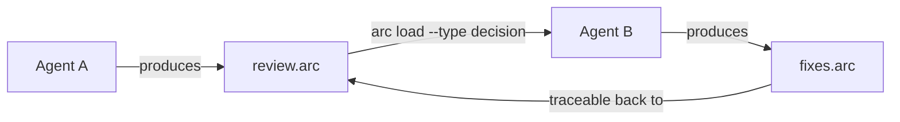
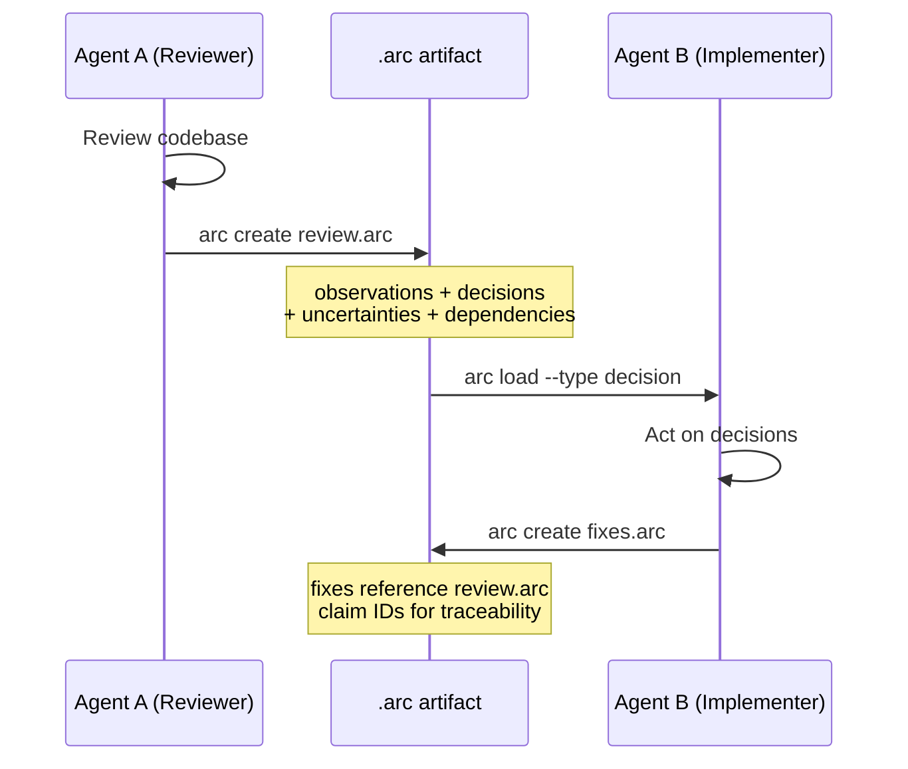
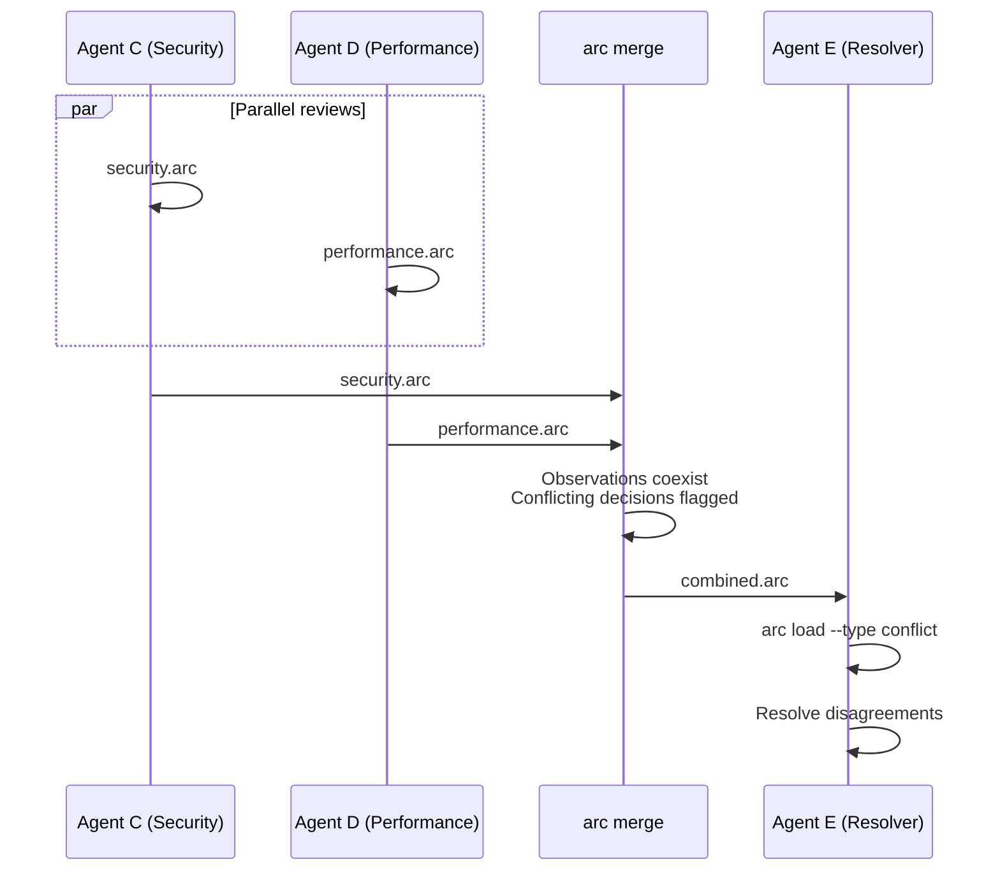
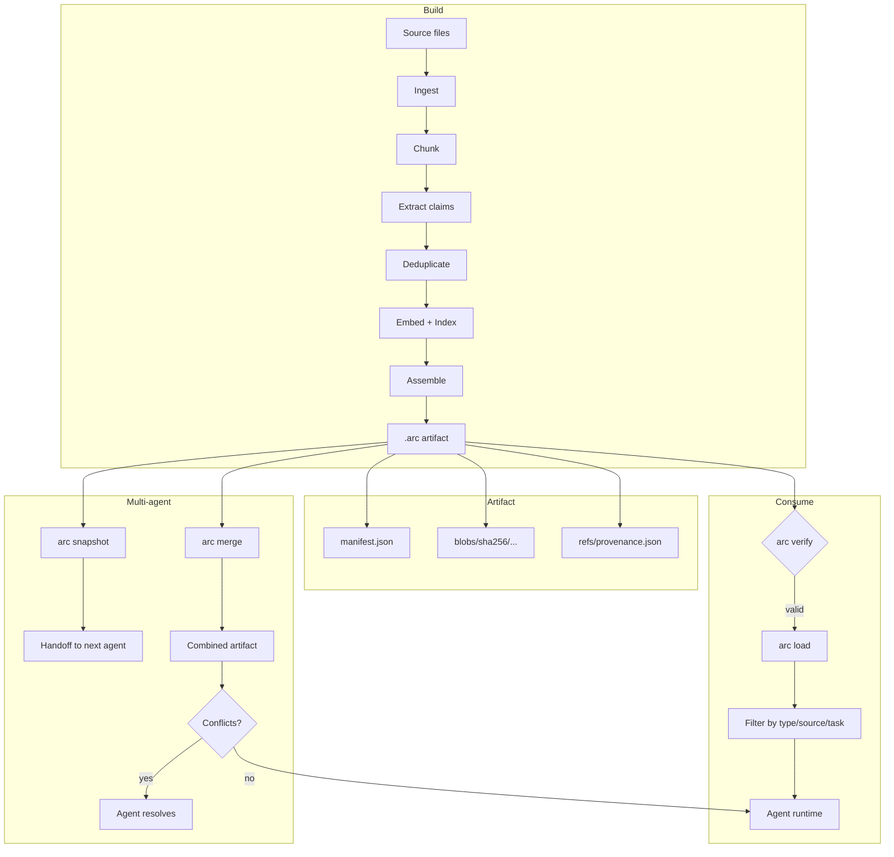

# ARC - Agent Reasoning Context

[](https://github.com/PJuniszewski/agent-archive/actions/workflows/test.yml)
[](https://pypi.org/project/arc-context/)
[](https://www.python.org)
[](LICENSE)
<!-- COVERAGE-BADGE-START -->
[](tests/)
<!-- COVERAGE-BADGE-END -->
[](https://github.com/PJuniszewski/ARC)

**A context passing protocol for AI agents.** ARC packages knowledge into verifiable, typed artifacts that agents can produce, consume, merge, and trace.

> MCP solved tool calling between agents. ARC solves context handoff.

---

## The problem

When agent A hands off work to agent B, context is lost:

```
Agent A: "I reviewed the auth module. Found 3 issues, decided to migrate to JWT."
Agent B: *starts from scratch, re-reads everything, reaches different conclusions*
```

Either A dumps raw text into B's prompt (noisy, unverifiable) or B rebuilds context from scratch (wasteful, inconsistent).

---

## How ARC solves it

ARC turns agent context into structured, verifiable artifacts:



Every claim in an ARC artifact has a **type**, **source**, **evidence**, and **confidence**. Nothing is opaque text.

---

## Claim types

ARC distinguishes what kind of knowledge is being passed:

| Type | Purpose | Example |
|------|---------|---------|
| `observation` | Factual, grounded in source | "auth/views.py uses session-based auth" |
| `decision` | Judgment by agent or human | "we should migrate to JWT" |
| `uncertainty` | Open question | "unclear if rate limiting applies to /admin" |
| `dependency` | Blocker or prerequisite | "requires updating middleware config" |
| `conflict` | Merge disagreement | Auto-generated when agents disagree |

---

## Install

```bash
pip install arc-context
```

---

## Quick start

### Build context from a codebase

```bash
arc build ./src --out project.arc
arc inspect project.arc
arc verify project.arc
```

### Query by type and source

```bash
arc load project.arc --task "auth migration"           # semantic search
arc load project.arc --type decision                   # only decisions
arc load project.arc --source agent-a                  # only from agent A
arc load project.arc --type decision --source agent-a  # compose filters
```

### Hand off context between agents

```bash
arc snapshot full.arc --out handoff.arc --last 10      # lightweight subset
arc merge security.arc performance.arc --out combined.arc  # parallel work
arc diff review.arc fixes.arc                          # compare artifacts
```

---

## Agent-to-agent workflow

### Sequential handoff



### Parallel merge



---

## Full pipeline



---

## Python API

```python
from arc import create_archive, load, merge, snapshot
from arc.models import Claim

# Agent produces claims
claims = [
    Claim(text="auth uses session tokens", claim_type="observation",
          source="review-agent", confidence=0.95),
    Claim(text="should migrate to JWT", claim_type="decision",
          source="review-agent", confidence=0.8),
]
create_archive("review.arc", claims, archive_id="arc://review")

# Next agent loads and filters
loaded = load("review.arc", claim_type="decision")
for claim in loaded.claims:
    print(f"[{claim.claim_type}] {claim.text} (by {claim.source})")

# Merge parallel work
result, manifest = merge("security.arc", "perf.arc", "combined.arc")
print(f"Conflicts: {result.conflicts_detected}")
```

---

## Architecture

```
Source -> Builder -> Artifact -> Loader -> Runtime
                        |
                    snapshot / merge
                        |
                  Agent-to-Agent handoff
```

- **Builder**: extracts typed claims from source (8-stage pipeline)
- **Artifact**: content-addressed, Merkle-sealed `.arc` directory
- **Loader**: selective loading with type/source/task filtering
- **Snapshot**: lightweight subset for quick handoffs
- **Merge**: combine parallel agent outputs, flag conflicts

Full design: [`docs/architecture.md`](docs/architecture.md) | Protocol: [`docs/protocol.md`](docs/protocol.md)

---

## CLI reference

| Command | Purpose |
|---------|---------|
| `arc build <dir> --out <path>` | Build archive from source directory |
| `arc snapshot <arc> --out <path> --last N` | Lightweight subset for handoff |
| `arc merge <a> <b> --out <path>` | Merge two archives, flag conflicts |
| `arc load <arc> [--type T] [--source S] [--task Q]` | Load and query |
| `arc inspect <arc>` | Show metadata and layers |
| `arc verify <arc>` | Check Merkle integrity |
| `arc diff <a> <b>` | Compare two archives |
| `arc restore <arc> --out <dir>` | Reconstruct source files |

---

## Benchmark

ARC preserves near-hybrid retrieval quality while making every result traceable:

<!-- BENCHMARK-START -->
30 tasks per repo, 6 categories. Context recall = fraction of required facts found.

### FastAPI (15K LOC, 130 files)

| System | Context Recall | Traceability | Debuggability | Token Efficiency |
|--------| ------------- | ------------- | ------------- | ------------- |
| hybrid | 0.450 | 0.000 | 0.000 | 0.999 |
| **hybrid_arc** | **0.450** | **1.000** | **0.940** | **0.997** |
| vector | 0.450 | 0.000 | 0.000 | 0.999 |
| arc | 0.250 | 1.000 | 0.000 | 0.998 |
| tfidf | 0.450 | 0.000 | 0.000 | 0.999 |

hybrid_arc vs hybrid: d = +0.000 (negligible)

Full analysis: [`docs/benchmark-fastapi-vs-django.md`](docs/benchmark-fastapi-vs-django.md)
<!-- BENCHMARK-END -->

- ~93% of hybrid recall with full evidence traceability (1.0 vs 0.0)
- 65%+ token reduction vs raw hybrid retrieval
- Tested on FastAPI (15K LOC) and Django (155K LOC)

---

## What ARC is not

- Not a vector database wrapper
- Not a runtime memory system
- Not a zip file with markdown
- Not framework-specific

---

## Benchmark

<!-- BENCHMARK-START -->
30 tasks per repo, 6 categories. Context recall = fraction of required facts found.

### FastAPI (15K LOC, 130 files)

| System | Context Recall | Traceability | Debuggability | Token Efficiency |
|--------| ------------- | ------------- | ------------- | ------------- |
| hybrid | 0.450 | 0.000 | 0.000 | 0.999 |
| **hybrid_arc** | **0.450** | **1.000** | **0.940** | **0.997** |
| vector | 0.450 | 0.000 | 0.000 | 0.999 |
| arc | 0.250 | 1.000 | 0.000 | 0.998 |
| tfidf | 0.450 | 0.000 | 0.000 | 0.999 |

hybrid_arc vs hybrid: d = +0.000 (negligible)

Full analysis: [`docs/benchmark-fastapi-vs-django.md`](docs/benchmark-fastapi-vs-django.md)
<!-- BENCHMARK-END -->

- ~93% of hybrid recall with full evidence traceability (1.0 vs 0.0)
- 65%+ token reduction vs raw hybrid retrieval

---

## Docs

| Document | Purpose |
|----------|---------|
| [`docs/protocol.md`](docs/protocol.md) | Context passing protocol for integrators |
| [`docs/claim-schema.md`](docs/claim-schema.md) | Typed claim schema design |
| [`docs/architecture.md`](docs/architecture.md) | 5-layer system model |
| [`docs/spec/arc-format.md`](docs/spec/arc-format.md) | Archive format specification |
| [`docs/spec/semantic-model.md`](docs/spec/semantic-model.md) | Claim, Decision, Evidence models |
| [`docs/spec/cli-contract.md`](docs/spec/cli-contract.md) | CLI command contracts |

---

## Development

```bash
make test              # run test suite
make lint              # ruff check
make benchmark-smoke   # quick benchmark on FastAPI snapshot
```

---

## License

Apache 2.0
