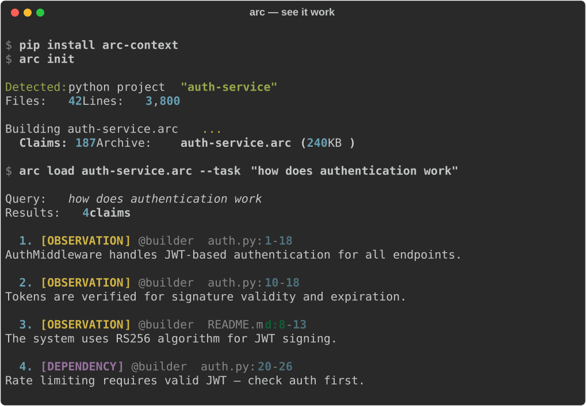

<p align="center">
  
</p>

<h3 align="center">Agents pass decisions with proof — down to the exact line of code.</h3>

<p align="center">
  <a href="https://github.com/PJuniszewski/agent-archive/actions/workflows/test.yml"></a>
  <a href="https://pypi.org/project/arc-context/"></a>
  <a href="https://www.python.org"></a>
  <a href="LICENSE"></a>
  <a href="https://github.com/PJuniszewski/ARC"></a>
</p>

---

## See it work

<p align="center">
  
</p>

Every result traces back to a **source file and line range**. Not a summary. Not a guess. A claim with evidence.

---

## What is ARC

ARC turns repository knowledge into a single `.arc` file — a typed, verifiable artifact that agents can produce, consume, merge, and trace.

```
Your code + docs ──> arc build ──> project.arc (single SQLite file)
                                        │
                    arc load --type decision ──> only decisions
                    arc load --source agent-a ──> only from agent A
                    arc load --task "auth" ──> semantic search
```

Each claim in the artifact has a **type** (observation, decision, uncertainty, dependency), a **source** (which agent or "builder"), **evidence** (file + line), and **confidence** (0-1).

---

## Why

When agent A hands off work to agent B, context is lost. A dumps raw text (noisy, unverifiable) or B starts from scratch (wasteful).

ARC fixes this:

```
Agent A ──> review.arc ──> Agent B loads only decisions ──> fixes.arc
                                                              │
              Traceable: B's fix → A's decision → source code line
```

Two agents work in parallel? Merge their artifacts:

```
security.arc ──┐
               ├── arc merge ──> combined.arc (conflicts flagged)
performance.arc┘
```

---

## Install

```bash
pip install arc-context
```

---

## Quick start

```bash
arc init                                               # detect project, build .arc
arc init --json                                        # structured output for agents

arc build ./src --out project.arc                      # manual build
arc load project.arc --task "auth migration"           # semantic search
arc load project.arc --type decision                   # filter by claim type
arc load project.arc --source agent-a                  # filter by source

arc snapshot full.arc --out handoff.arc --last 10      # lightweight handoff
arc merge security.arc perf.arc --out combined.arc     # parallel work
arc diff v1.arc v2.arc                                 # compare versions
arc verify project.arc                                 # check integrity
```

---

## Claim types

| Type | What it means | Example |
|------|--------------|---------|
| `observation` | Fact from source code | "auth.py uses JWT with RS256" |
| `decision` | Judgment by agent or human | "should migrate to OAuth2" |
| `uncertainty` | Open question | "unclear if rate limiting covers /admin" |
| `dependency` | Blocker | "requires Redis for session store" |
| `conflict` | Merge disagreement | Auto-generated when agents disagree |

---

## Python API

```python
from arc import create_archive, load, merge
from arc.models import Claim

# Agent produces typed claims
claims = [
    Claim(text="auth uses session tokens", claim_type="observation",
          source="review-agent", confidence=0.95),
    Claim(text="should migrate to JWT", claim_type="decision",
          source="review-agent", confidence=0.8),
]
create_archive("review.arc", claims)

# Next agent loads only decisions
loaded = load("review.arc", claim_type="decision")
for c in loaded.claims:
    print(f"[{c.claim_type}] {c.text} (by {c.source})")

# Merge parallel work
result, _ = merge("security.arc", "perf.arc", "combined.arc")
print(f"Conflicts: {result.conflicts_detected}")
```

---

## Architecture

```
Source -> Builder -> .arc artifact -> Loader -> Agent runtime
                         │
                   snapshot / merge
                         │
                  Agent-to-Agent handoff
```

- **Builder**: 8-stage pipeline (ingest, chunk, extract, dedup, embed, assemble)
- **Artifact**: single-file SQLite with Merkle integrity
- **Loader**: selective loading by type, source, or semantic query
- **Snapshot**: lightweight subset for quick handoffs
- **Merge**: combine parallel outputs, flag conflicting decisions

**Extraction guarantees:**
- **Deterministic (default)** — same source produces identical claims and digests. Rule-based extraction, no LLM.
- **LLM-assisted (opt-in)** — `--extract-with-llm` sends full files to LLM for richer claims. Trades determinism for 100% recall.
- **Reproducible** — content-addressed storage means builds are verifiable. Rebuild from source, compare digests.
- **Tamper-detected** — 100% detection rate on single-byte flips, blob deletion, manifest modification (tested exhaustively).

---

## CLI reference

| Command | Purpose |
|---------|---------|
| `arc init [dir] [--json]` | Detect project, build first `.arc` |
| `arc build <dir> --out <path>` | Build `.arc` from source |
| `arc load <arc> [--type] [--source] [--task]` | Load and query |
| `arc snapshot <arc> --out <path> --last N` | Lightweight subset |
| `arc merge <a> <b> --out <path>` | Merge, flag conflicts |
| `arc verify <arc>` | Check Merkle integrity |
| `arc diff <a> <b>` | Compare two archives |
| `arc inspect <arc>` | Show metadata |
| `arc restore <arc> --out <dir>` | Reconstruct source files |

---

## Benchmark

<!-- BENCHMARK-START -->
30 tasks per repo, 6 categories. Context recall = fraction of required facts found.

### FastAPI (15K LOC, 130 files)

| System | Context Recall | Traceability | Debuggability | Token Efficiency |
|--------| ------------- | ------------- | ------------- | ------------- |
| hybrid | 0.500 | 0.000 | 0.000 | 0.995 |
| **hybrid_arc** | **0.450** | **1.000** | **0.940** | **0.997** |
| vector | 0.450 | 0.000 | 0.000 | 0.999 |
| arc | 0.300 | 1.000 | 0.000 | 0.672 |
| tfidf | 0.450 | 0.000 | 0.000 | 0.999 |

hybrid_arc vs hybrid: d = -0.147 (negligible)

Full analysis: [`docs/benchmark-fastapi-vs-django.md`](docs/benchmark-fastapi-vs-django.md)
<!-- BENCHMARK-END -->

**Systems:** hybrid_arc = ARC (the product). hybrid = best raw RAG baseline (vector + keyword, no traceability). vector = embedding-only. tfidf = keyword-only. arc = base ARC without refinement.

**Takeaway:** ARC matches the best raw retrieval on recall, while adding full traceability (1.0 vs 0.0) — every result links to source file + line. The baselines find the same facts but can't prove where they came from.

---

## Docs

| Document | Purpose |
|----------|---------|
| [`docs/protocol.md`](docs/protocol.md) | Context passing protocol for integrators |
| [`docs/claim-schema.md`](docs/claim-schema.md) | Typed claim schema design |
| [`docs/single-file-format.md`](docs/single-file-format.md) | SQLite archive format |
| [`docs/architecture.md`](docs/architecture.md) | 5-layer system model |

---

## When to use ARC

- **Multi-agent code review** — Agent A reviews, Agent B fixes. B sees A's decisions with evidence, not a vague summary.
- **Debug multi-agent failures** — trace any agent's output back through the chain: this fix was made because of this decision, which was based on this line of code.
- **Parallel agent work** — two agents review different aspects. Merge their artifacts. Conflicting decisions surface automatically.
- **Audit trail for AI decisions** — "why did the agent change this file?" → load the `.arc`, filter to decisions, follow evidence pointers.
- **Context handoff without token waste** — pass a 4KB `.arc` instead of pasting 50KB of raw files into the next agent's prompt.

## What ARC is not

- Not a vector database
- Not a runtime memory system
- Not framework-specific
- Not another agent framework

---

## Development

```bash
make test              # 442 tests
make lint              # ruff
make benchmark-smoke   # FastAPI benchmark
```

Apache 2.0
